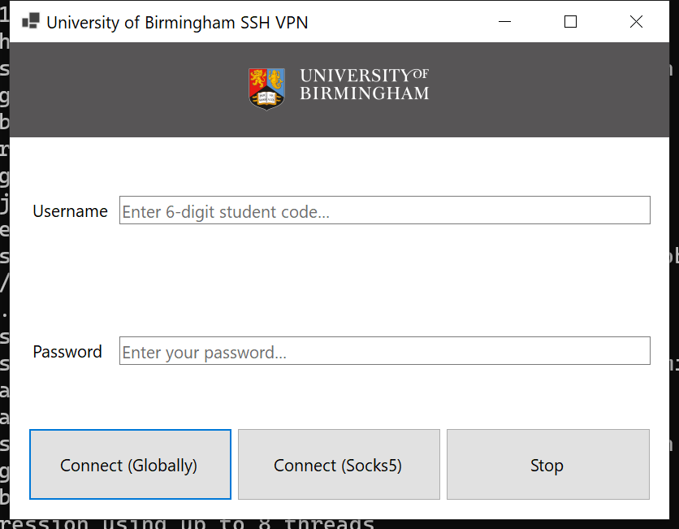

# University of Birmingham SSH VPN Client*for Windows*

## Description

This application provides a GUI to help you access the University of Birmingham's intranet by tinky-winky (tinky-winky.cs.bham.ac.uk).

  

*This application is currently under development. There is no guarantee that it works perfectly.*

## Principal

By default, we (Client) visit website (Target) directly without any additional things. However, if we need to enter some specific websites which require some network features (e.g. IP, ASN, etc.), we may need a proxy. This is usually how a VPN gateway does.

## 3rd Party Components

- **plink** licensed under **MIT**
- **Privoxy** licensed under **GNU GPLv2**

